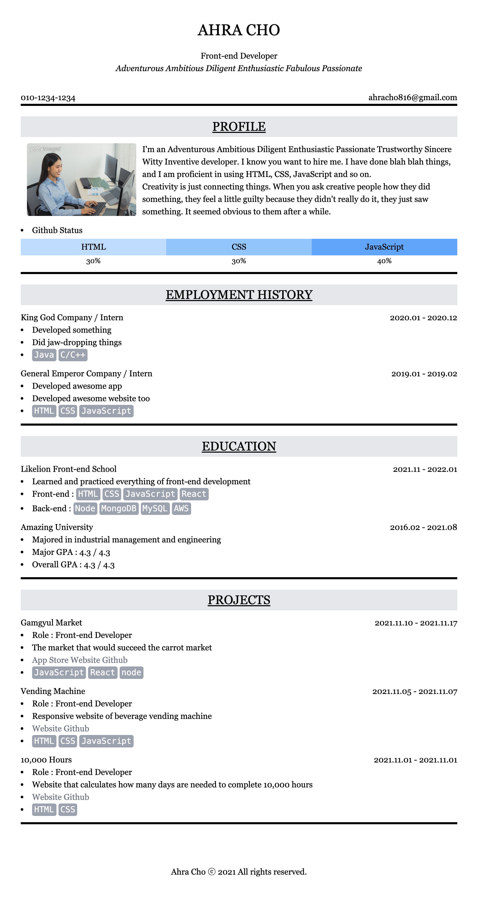

# tailwind-resume
HTML과 tailwindcss만 사용하여 만든 이력서입니다.

## 1. 목표와 기능
### 1.1 목표
- HTML, tailwindcss의 활용

### 1.2 기능
- 이력서 화면을 제공합니다.

## 2. 개발 환경 및 배포 URL
### 2.1 개발 환경
- 서비스 배포 환경
  - GitHub Pages
### 2.2 배포 URL
- https://choar816.github.io/tailwind-resume/

## 3. 프로젝트 구조
```
.
├── index.html
└── resume-capture.png

```

## 4. 실행 화면


## 5. 개발하며 느낀 점
- 빠른 개발이 필요할 때 사용하는 Bootstrap, Tailwind와 같은 툴을 직접 만들어 볼 수도 있겠다는 생각이 들었습니다.

